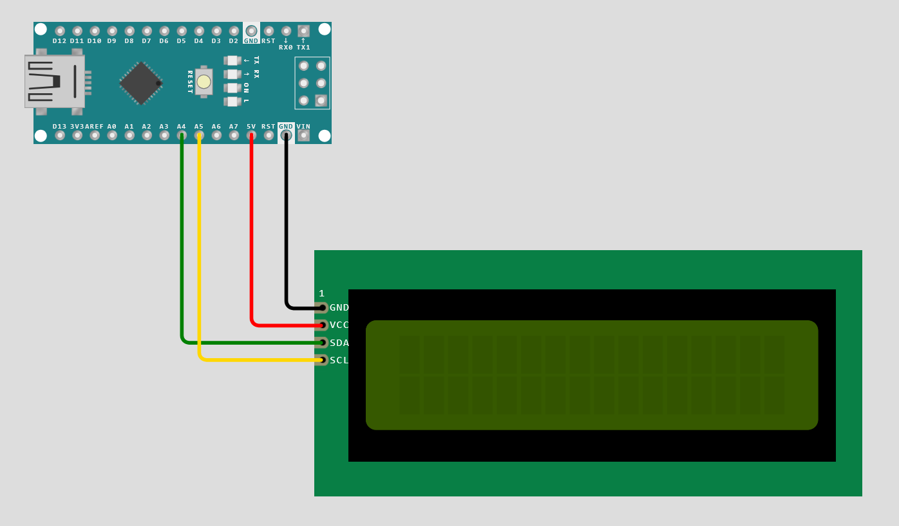
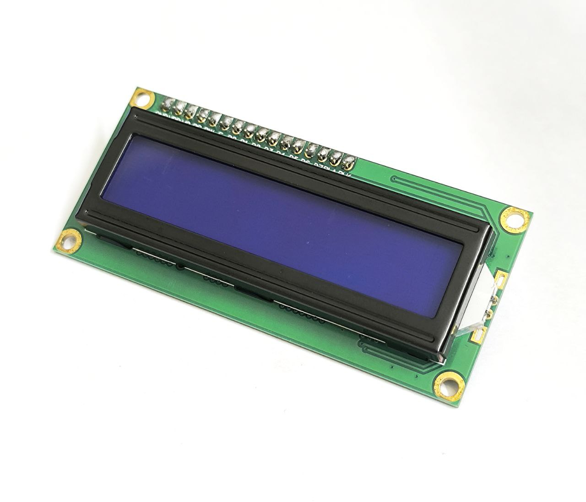
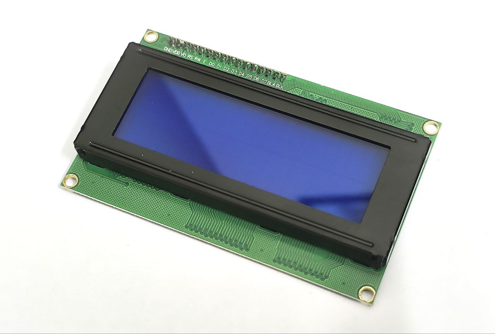

# LCD

**Liquid Crystal Display** or **LCD**, is a flat-panel display technology that uses liquid crystals to modulate light and create images. This section provides sample code and wiring diagrams for common LCD modules designed for use with Arduino and ESP32 boards.

<!-- prettier-ignore-start -->
> [!IMPORTANT]
We need to install the [**LiquidCrystal_I2C**][lcd-lib] library to use the LCD modules through the **I2C protocol**. All of the LCD modules use an [**I2C adapter**][i2c-adapter].
<!-- prettier-ignore-end -->

-   [**16x2 LCD Module**](#16x2-lcd-module)
-   [**20x4 LCD Module**](#20x4-lcd-module)

## Wiring Diagram

| OLED&nbsp;Module | Arduino&nbsp;Nano | Arduino&nbsp;Mega | ESP32        |
| :--------------- | :---------------- | :---------------- | :----------- |
| **SDA**          | A4                | GPIO&nbsp;20      | GPIO&nbsp;21 |
| **SCL**          | A5                | GPIO&nbsp;21      | GPIO&nbsp;22 |
| **GND**          | GND               | GND               | GND          |
| **VCC**          | 5V                | 5V                | 5V           |

-   [📌 **Simulation with an Arduino Nano**][sim-arduino-16-2]
-   [📌 **Simulation with an ESP32 Dev Module**][sim-esp32-16-2]

## Physical Dimensions

| Module              | LCD&nbsp;Display&nbsp;(W&nbsp;×&nbsp;L&nbsp;×&nbsp;B) | Breakout&nbsp;Board&nbsp;(W&nbsp;×&nbsp;L&nbsp;×&nbsp;B) |
| :------------------ | :---------------------------------------------------- | -------------------------------------------------------- |
| **16x2 LCD Module** | 71.0 × 24.1 × 6.8 mm                                  | 80.0 × 36.0 × 9.0 mm                                     |
| **20x4 LCD Module** | 96.8 × 39.5 × 8.6 mm                                  | 98.0 × 60.0 × 10.0 mm                                    |

## 16x2 LCD Module

[📄 **01-I2C-16x2.ino**](./01-I2C-16x2.ino)

[📌 **Simulation with an Arduino Nano**][sim-arduino-16-2]

| Feature            |                               |
| :----------------- | :---------------------------- |
| **Driver IC**      | ST7066                        |
| **Device Address** | `0x27`                        |
| **Resolution**     | 16×2 characters               |
| **Colors**         | **Blue**, White, Yellow       |
| **Purchase Link**  | [**📌 RoboticsBD**][lcd-16-2] |

## 20x4 LCD Module

[📄 **02-I2C-20x4.ino**](./02-I2C-20x4.ino)

[📌 **Simulation with an Arduino Nano**][sim-arduino-20-4]

| Feature            |                               |
| :----------------- | :---------------------------- |
| **Driver IC**      | ST7066                        |
| **Device Address** | `0x27`                        |
| **Resolution**     | 20×4 characters               |
| **Colors**         | **Blue**, White, Yellow       |
| **Purchase Link**  | [**📌 RoboticsBD**][lcd-20-4] |

[sim-arduino-16-2]: https://wokwi.com/projects/423532933358044161
[sim-arduino-20-4]: https://wokwi.com/projects/423710320927631361
[sim-esp32-16-2]: https://wokwi.com/projects/423719772086753281
[lcd-lib]: https://github.com/johnrickman/LiquidCrystal_I2C
[lcd-16-2]: https://store.roboticsbd.com/display/1642-lcd-16x2-blue-backlight-robotics-bangladesh.html
[lcd-20-4]: https://store.roboticsbd.com/robotics-parts/161-20x4-character-lcd-blue-backlight-robotics-bangladesh.html
[i2c-adapter]: https://store.roboticsbd.com/display/433-i2c-lcd-adapter-module-robotics-bangladesh.html
