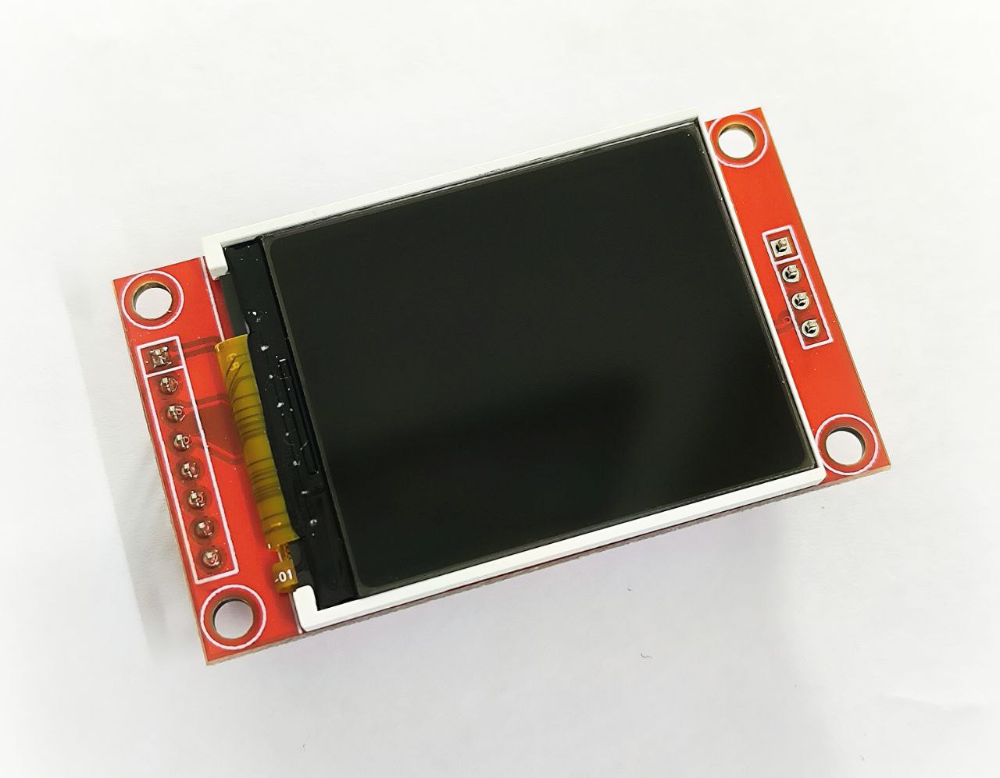
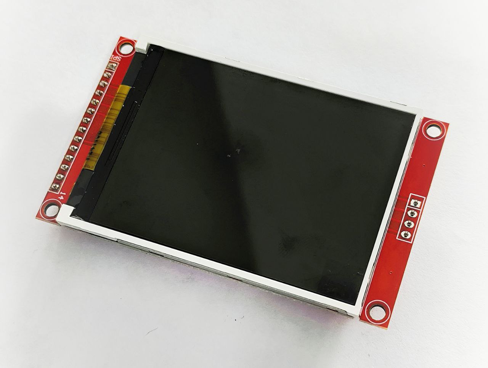
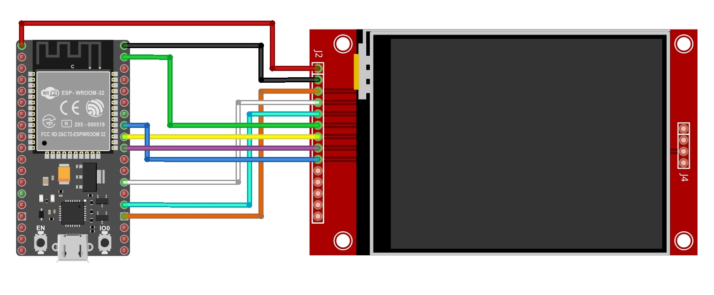
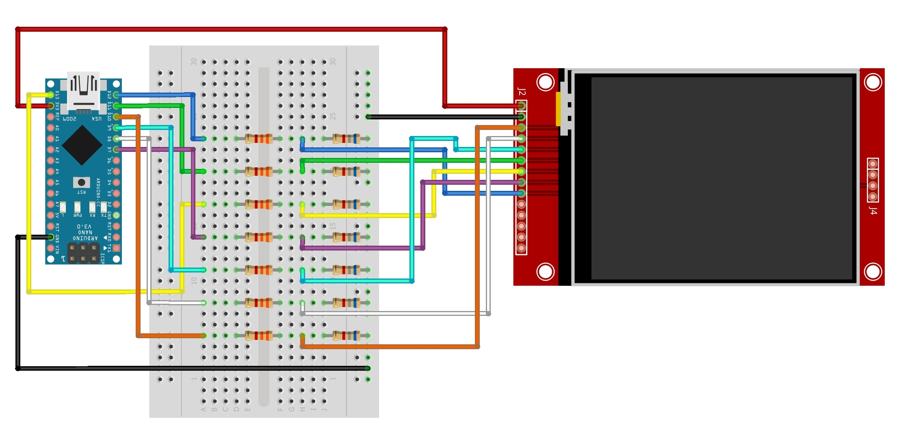
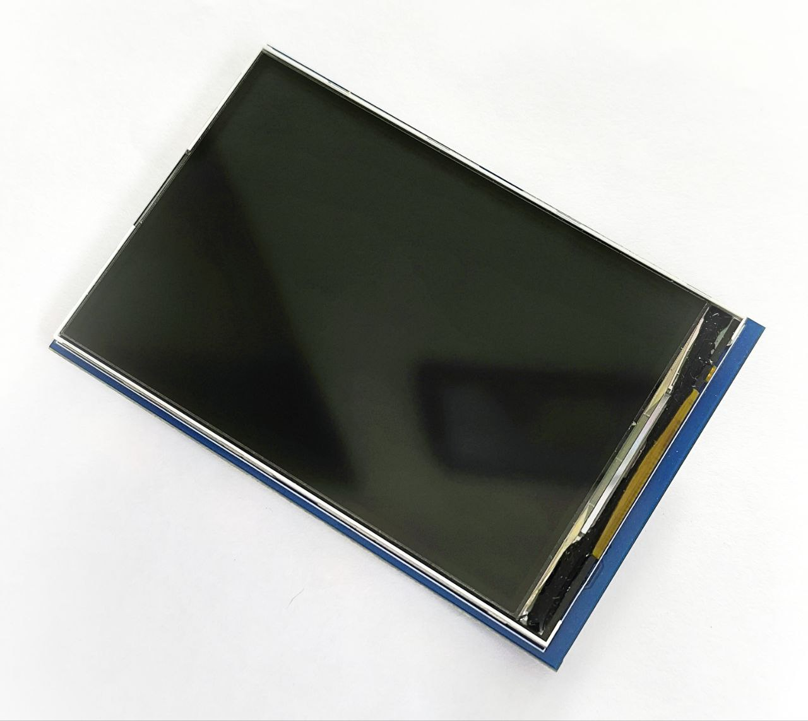
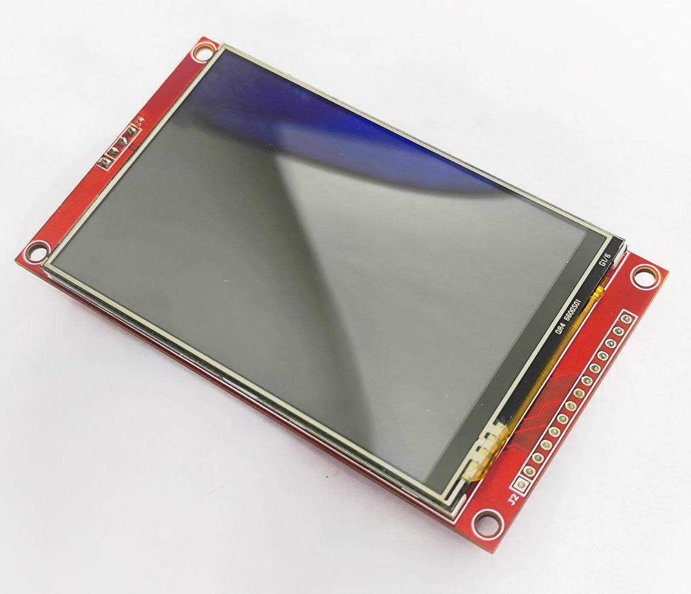

# TFT

**TFT** stands for **Thin Film Transistor**. TFT is a type of display technology, most commonly used in LCD screens, where each pixel is controlled by a tiny transistor. This section provides sample code and wiring diagrams for various TFT display modules designed for use with Arduino and ESP32 boards.

<!-- prettier-ignore-start -->
> [!IMPORTANT]
We are using the [**Adafruit GFX library**](https://github.com/adafruit/Adafruit-GFX-Library) across all the displays to provide a unified API. Although we use the same graphics library, we need to install additional hardware-specific libraries for different TFT display modules. All of these TFT display modules (except the shield) use the **SPI protocol**.
<!-- prettier-ignore-end -->

-   [**1.8" TFT display module**](#18-inch-tft-display-module)
-   [**2.8" TFT display module**](#28-inch-tft-display-module)
-   [**3.5" TFT display shield (No Touch)**](#35-inch-tft-display-shield)
-   [**3.5" TFT display breakout board (with Touch)**](#35-inch-tft-display-breakout-board)

## Physical Dimensions

| Module                                                  | TFT&nbsp;Display&nbsp;(W&nbsp;×&nbsp;L&nbsp;×&nbsp;B) | Breakout&nbsp;Board&nbsp;(W&nbsp;×&nbsp;L&nbsp;×&nbsp;B) |
| :------------------------------------------------------ | :---------------------------------------------------- | -------------------------------------------------------- |
| **1.8"&nbsp;TFT&nbsp;display&nbsp;module**              | 38.1 × 32.0 × 3.3 mm                                  | 57.8 × 33.7 × 7.8 mm                                     |
| **2.8"&nbsp;TFT&nbsp;display&nbsp;module**              | 69.1 × 49.9 × 3.1 mm                                  | 81.6 × 49.9 × 7.8 mm                                     |
| **3.5"&nbsp;TFT&nbsp;display&nbsp;shield**              | 82.8 × 54.2 × 3.3 mm                                  | 86.5 × 57.4 × 6.8 mm                                     |
| **3.5"&nbsp;TFT&nbsp;display&nbsp;breakout&nbsp;board** | 83.8 × 54.4 × 4.5 mm                                  | 97.9 × 56.0 × 9.1 mm                                     |

## Technical Specifications

| Module                      | Driver&nbsp;IC    | Resolution          | Logic&nbsp;Level | Protocol             | SD&nbsp;Card | Touch&nbsp;Driver | Backlight&nbsp;Control |
| :-------------------------- | :---------------- | :------------------ | :--------------- | :------------------- | :----------- | :---------------- | :--------------------- |
| 1.8"&nbsp;TFT               | ST7735            | **128×160&nbsp;px** | 3V3              | SPI                  | Yes          | -                 | GPIO                   |
| 2.8"&nbsp;TFT               | ILI9481           | **240×320&nbsp;px** | 3V3              | SPI                  | Yes          | -                 | GPIO                   |
| 3.5"&nbsp;TFT&nbsp;Shield   | ST7789            | **320×480&nbsp;px** | 3V3 or **5V**    | **8bit&nbsp;serial** | **MicroSD**  | -                 | **No**                 |
| 3.5"&nbsp;TFT&nbsp;Breakout | ILI9488/ILI9341\* | **320×480&nbsp;px** | 3V3              | SPI                  | Yes          | **XPT2046**       | GPIO                   |

## 1.8 inch TFT display module



> [!NOTE]
> This TFT display module requires the [**Adafruit ST7735 and ST7789**](https://github.com/adafruit/Adafruit-ST7735-Library) library.

[📄 **01-ST7735.ino**](./01-ST7735.ino)

[📌 **Purchase Link (RoboticsBD)**](https://store.roboticsbd.com/display/699-tft-lcd-display-module-st7735s-128x160-robotics-bangladesh.html)

### Wiring Diagram (ESP32)

| 1.8"&nbsp;TFT | ESP32&nbsp;Dev&nbsp;Module | Remarks                          |
| :------------ | :------------------------- | :------------------------------- |
| LED           | GPIO 5                     | Backlight                        |
| SCK           | GPIO 18                    | Serial&nbsp;Clock                |
| SDA           | GPIO 23                    | Serial&nbsp;Data                 |
| A0 (DC)       | GPIO 2                     | Data&nbsp;Control                |
| RST           | GPIO 4                     | Reset                            |
| CS            | GPIO 15                    | Chip&nbsp;Select                 |
| GND           | GND                        | Ground                           |
| VCC           | **3V3**                    | **Do&nbsp;NOT&nbsp;use&nbsp;5V** |

## 2.8 inch TFT display module



> [!NOTE]
> This TFT display module requires the [**Adafruit ST7735 and ST7789**](https://github.com/adafruit/Adafruit-ST7735-Library) library.

[📄 **03-ST7789.ino** (for ESP32 and Arduino Nano)](./03-ST7789.ino)

[📌 **Purchase Link (RoboticsBD)**](https://store.roboticsbd.com/display/2465-tft-lcd-28-240320-rgb-spi-display-with-touchscreen-robotics-bangladesh.html)

### Wiring Diagram (ESP32)



| 2.8"&nbsp;TFT   | ESP32&nbsp;Dev&nbsp;Module | Remarks                          |
| :-------------- | :------------------------- | :------------------------------- |
| SDO&nbsp;(MISO) | GPIO 19                    | Serial&nbsp;Data&nbsp;Out        |
| LED             | GPIO 5                     | Backlight                        |
| SCK             | GPIO 18                    | Serial&nbsp;Clock                |
| SDI&nbsp;(MOSI) | GPIO 23                    | Serial&nbsp;Data&nbsp;In         |
| DC              | GPIO 2                     | Data&nbsp;Control                |
| RESET           | GPIO 4                     | Reset                            |
| CS              | GPIO 15                    | Chip&nbsp;Select                 |
| GND             | GND                        | Ground                           |
| VCC             | **3V3**                    | **Do&nbsp;NOT&nbsp;use&nbsp;5V** |

### Wiring Diagram (Arduino)



> [!CAUTION]
> The TFT display module operates at a logic level of **3.3V**, while the Arduino Nano functions at a **5V** logic level. To ensure compatibility, we need to add a **voltage divider for all signal wires** to shift the logic level from **5V** to **3.3V**.
>
> ```
>    Arduino pin
>        |
>      [3.3K]
>        |--------> TFT pin
>      [6.8K]
>        |
>       GND
> ```

| 2.8"&nbsp;TFT   | Arduino&nbsp;Nano | Remarks                          |
| :-------------- | :---------------- | :------------------------------- |
| SDO&nbsp;(MISO) | GPIO 12           | Serial&nbsp;Data&nbsp;Out        |
| LED             | GPIO 7            | Backlight                        |
| SCK             | GPIO 13           | Serial&nbsp;Clock                |
| SDI&nbsp;(MOSI) | GPIO 11           | Serial&nbsp;Data&nbsp;In         |
| DC              | GPIO 9            | Data&nbsp;Control                |
| RESET           | GPIO 8            | Reset                            |
| CS              | GPIO 10           | Chip&nbsp;Select                 |
| GND             | GND               | Ground                           |
| VCC             | **3V3**           | **Do&nbsp;NOT&nbsp;use&nbsp;5V** |

## 3.5 inch TFT display shield



> [!NOTE]
> This TFT display shield requires the [**MCUFRIEND_kbv**](https://github.com/prenticedavid/MCUFRIEND_kbv) library.

[📄 **02-ILI9481.ino**](./02-ILI9481.ino)

[📌 **Purchase Link (RoboticsBD)**](https://store.roboticsbd.com/arduino-shield/1219-35inch-lcd-shield-for-arduino-robotics-bangladesh.html)

### Wiring Diagram (Arduino Nano/Mega)

> [!CAUTION]
> These TFT display shields are only compatible with Arduino **Uno**, **Nano**, and **Mega**.

| 3.5"&nbsp;TFT | Arduino&nbsp;Nano/Mega | Remarks                                       |
| :------------ | :--------------------- | :-------------------------------------------- |
| RESET         | RST                    | Reset                                         |
| LCD_RST       | A4                     | LCD&nbsp;Reset                                |
| LCD_CS        | A3                     | Chip&nbsp;Select                              |
| LCD_RS        | A2                     | Data&nbsp;Select&nbsp;Signal                  |
| LCD_WR        | A1                     | Data&nbsp;Write&nbsp;Signal                   |
| LCD_RD        | A0                     | Data&nbsp;Read&nbsp;Signal                    |
| LCD_D0        | GPIO&nbsp;8            | 8bit&nbsp;Data&nbsp;Bit&nbsp;0                |
| LCD_D1        | GPIO&nbsp;9            | 8bit&nbsp;Data&nbsp;Bit&nbsp;1                |
| LCD_D2        | GPIO&nbsp;2            | 8bit&nbsp;Data&nbsp;Bit&nbsp;2                |
| LCD_D3        | GPIO&nbsp;3            | 8bit&nbsp;Data&nbsp;Bit&nbsp;3                |
| LCD_D4        | GPIO&nbsp;4            | 8bit&nbsp;Data&nbsp;Bit&nbsp;4                |
| LCD_D5        | GPIO&nbsp;5            | 8bit&nbsp;Data&nbsp;Bit&nbsp;5                |
| LCD_D6        | GPIO&nbsp;6            | 8bit&nbsp;Data&nbsp;Bit&nbsp;6                |
| LCD_D7        | GPIO&nbsp;7            | 8bit&nbsp;Data&nbsp;Bit&nbsp;7                |
| GND           | GND                    | Ground                                        |
| VCC           | **5V**                 | Can&nbsp;use&nbsp;**5V**&nbsp;or&nbsp;**3V3** |

## 3.5 inch TFT display breakout board



> [!NOTE]
> To use this TFT display module with an ESP32, we need the [**tft_eSPI**](https://github.com/Bodmer/TFT_eSPI) library. To use this module with an Arduino Nano, we need this [**ILI9488**](https://github.com/jaretburkett/ILI9488) library.

[📄 **04-ILI9488.ino** (for ESP32 Dev Module)](./04-ILI9488.ino)

[📄 **04-ILI9488-nano.ino** (for Arduino Nano)](./04-ILI9488-nano.ino)

[📌 **Purchase Link (TechshopBD)**](https://techshopbd.com/product/tft-lcd-display-module-35-inch-with-touch)

### Wiring Diagram (ESP32)


> [!CAUTION]
> In order to make this TFT display work, we have to edit the `User_Setup.h` header file provided in the **tft_eSPI** library folder. Locate the file in your Arduino libaries folder and replace its contents with the following:
>
> ```
> #define USER_SETUP_INFO "User_Setup"
> #define ILI9488_DRIVER
>
> #define TFT_MISO 19
> #define TFT_MOSI 23
> #define TFT_SCLK 18
> #define TFT_CS 15
> #define TFT_DC 2
> #define TFT_RST 4
>
> #define LOAD_GLCD
> #define LOAD_FONT2
> #define LOAD_FONT4
> #define LOAD_FONT6
> #define LOAD_FONT7
> #define LOAD_FONT8
> // #define LOAD_FONT8N
> #define LOAD_GFXFF
>
> #define SMOOTH_FONT
>
> #define SPI_FREQUENCY 27000000
> #define SPI_READ_FREQUENCY 20000000
> #define SPI_TOUCH_FREQUENCY 2500000
> ```

| 3.5"&nbsp;TFT   | ESP32&nbsp;Dev&nbsp;Module | Remarks                          |
| :-------------- | :------------------------- | :------------------------------- |
| SDO&nbsp;(MISO) | GPIO 19                    | Serial&nbsp;Data&nbsp;Out        |
| LED             | GPIO 5                     | Backlight                        |
| SCK             | GPIO 18                    | Serial&nbsp;Clock                |
| SDI&nbsp;(MOSI) | GPIO 23                    | Serial&nbsp;Data&nbsp;In         |
| DC              | GPIO 2                     | Data&nbsp;Control                |
| RESET           | GPIO 4                     | Reset                            |
| CS              | GPIO 15                    | Chip&nbsp;Select                 |
| GND             | GND                        | Ground                           |
| VCC             | **3V3**                    | **Do&nbsp;NOT&nbsp;use&nbsp;5V** |

### Wiring Diagram (Arduino)


> [!CAUTION]
> The TFT display module operates at a logic level of **3.3V**, while the Arduino Nano functions at a **5V** logic level. To ensure compatibility, we need to add a **voltage divider for all signal wires** to shift the logic level from **5V** to **3.3V**.
>
> ```
>    Arduino pin
>        |
>      [3.3K]
>        |--------> TFT pin
>      [6.8K]
>        |
>       GND
> ```

| 3.5"&nbsp;TFT   | Arduino&nbsp;Nano | Remarks                                       |
| :-------------- | :---------------- | :-------------------------------------------- |
| SDO&nbsp;(MISO) | GPIO 12           | Serial&nbsp;Data&nbsp;Out                     |
| LED             | GPIO 7            | Backlight                                     |
| SCK             | GPIO 13           | Serial&nbsp;Clock                             |
| SDI&nbsp;(MOSI) | GPIO 11           | Serial&nbsp;Data&nbsp;In                      |
| DC              | GPIO 9            | Data&nbsp;Control                             |
| RESET           | GPIO 8            | Reset                                         |
| CS              | GPIO 10           | Chip&nbsp;Select                              |
| GND             | GND               | Ground                                        |
| VCC             | **5V**            | Can&nbsp;use&nbsp;**5V**&nbsp;or&nbsp;**3V3** |
