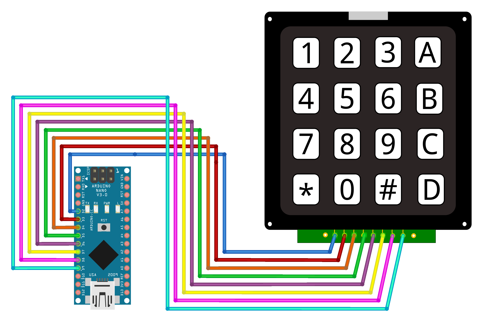
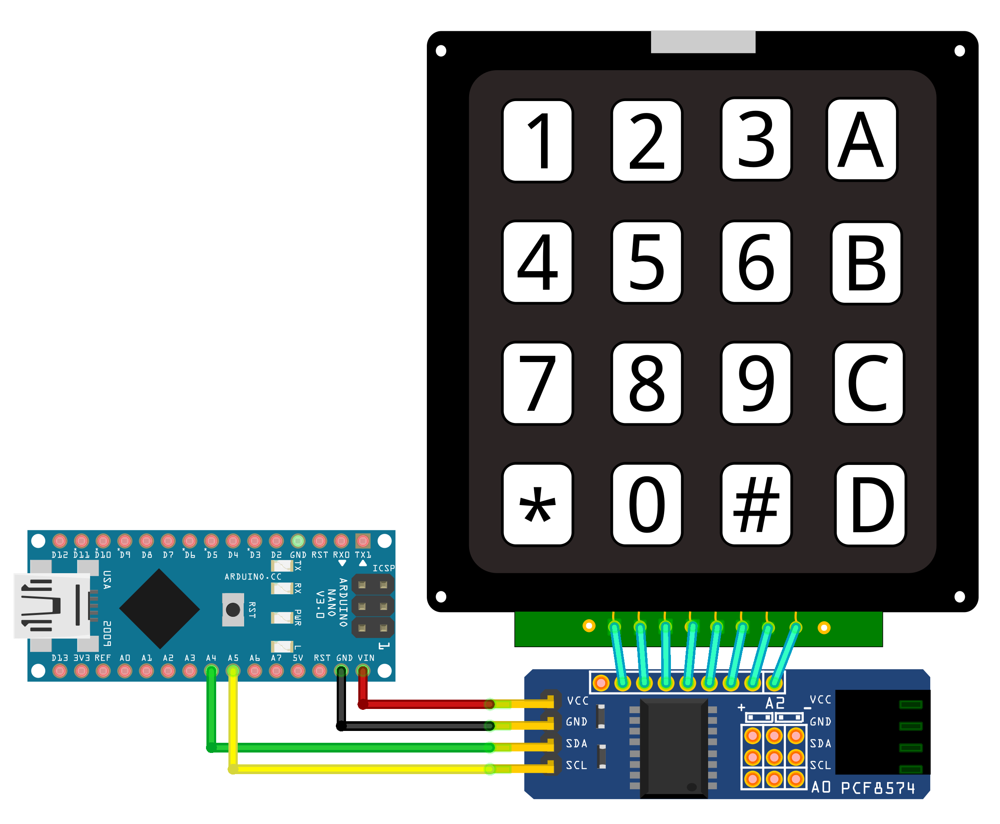

# Keypad

Keypads are a great way to incorporate user input to our projects. There are traditionally two types of Keypads available,

- **Membrane Keypad**
- **Generic Tactile Switch Keypad**

Membrane Keypads are available in **1×4**, **3×4**, and **4×4** key configurations whereas Tactile Switch Keypads are only available in **4×4** key configuration.

<!-- prettier-ignore-start -->
> [!CAUTION]
**Membrane Keypads** are extremely flimsy and the adhesive reportedly dries out quickly. Also the buttons are not comfortable to press on. So, it is generally a good idea to avoid these Membrane Keypads. **Generic Tactile Switch Keypads** are usually a better choice for most applications.
<!-- prettier-ignore-end -->

## Module Supplies

### Membrane Keypad

- [**1×4&nbsp;(1&nbsp;column,&nbsp;4&nbsp;rows)**](https://rcgearbd.com/product/1-2-3-4-12-16-20-key-button-membrane-switch-1x4-3x4-4x4-4x5-keys-matrix-array-keyboard-keypad-control-panel-diy-kit-for-arduino/)
- [**3×4&nbsp;(3&nbsp;columns,&nbsp;4&nbsp;rows)**](https://store.roboticsbd.com/keypad-touch-human-interface/402--34-flexible-keypad-robotics-bangladesh.html)
- [**4×4&nbsp;(4&nbsp;columns,&nbsp;4&nbsp;rows)**](https://store.roboticsbd.com/keypad-touch-human-interface/986-4x4-keypad-16-key-matrix-membrane-type-robotics-bangladesh.html)

### Tactile Switch Keypad

- [**4×4&nbsp;(4&nbsp;columns,&nbsp;4&nbsp;rows)**](https://store.roboticsbd.com/electronics-module/2156-44-matrix-16-keyboard-keypad-robotics-bangladesh.html)

## Physical Dimensions

| Membrane&nbsp;Keypad                            | Dimensions&nbsp;(W&nbsp;×&nbsp;L&nbsp;×&nbsp;B) |
| :---------------------------------------------- | :---------------------------------------------- |
| **1×4&nbsp;(1&nbsp;column,&nbsp;4&nbsp;rows)**  | 69.2 × 19.0 × 0.8 mm                            |
| **3×4&nbsp;(3&nbsp;columns,&nbsp;4&nbsp;rows)** | 69.2 × 76.2 × 0.8 mm                            |
| **4×4&nbsp;(4&nbsp;columns,&nbsp;4&nbsp;rows)** | 76.2 × 76.2 × 0.8 mm                            |

| Tactile&nbsp;Switch&nbsp;Keypad                 | Dimensions&nbsp;(W&nbsp;×&nbsp;L&nbsp;×&nbsp;B) |
| :---------------------------------------------- | :---------------------------------------------- |
| **4×4&nbsp;(4&nbsp;columns,&nbsp;4&nbsp;rows)** | 59.8 × 56.8 × 7.3 mm                            |

## Tactile Switch Keypad (8 Pin)

[📄 **01-keypad-generic.ino**](./01-keypad-generic.ino)

### Wiring Diagram (Arduino)

| Keypad     | Arduino&nbsp;Nano |
| :--------- | :---------------- |
| 1          | N/C               |
| 2 **(C1)** | 2                 |
| 3 **(C2)** | 3                 |
| 4 **(C3)** | 4                 |
| 5 **(C4)** | 5                 |
| 6 **(R1)** | 6                 |
| 7 **(R2)** | 7                 |
| 8 **(R3)** | 8                 |
| 9 **(R4)** | 9                 |
| 10         | N/C               |

## Tactile Switch Keypad (I2C)

Here we use an I2C expansion module [**(PCF8574)**](https://store.roboticsbd.com/electronics-module/2727-pcf8574-i2c-io-expansion-module-robotics-bangladesh.html) to use the keypad using only two pins (**SDA**, **SCL**).

[📄 **02-keypad-i2c.ino**](./01-keypad-i2c.ino)

### Wiring Diagram (Arduino)

| Keypad     | PCF8574&nbsp;I2C&nbsp;Module |
| :--------- | :--------------------------- |
| 1          | N/C                          |
| 2 **(C1)** | O7                           |
| 3 **(C2)** | O6                           |
| 4 **(C3)** | O5                           |
| 5 **(C4)** | O4                           |
| 6 **(R1)** | O3                           |
| 7 **(R2)** | O2                           |
| 8 **(R3)** | O1                           |
| 9 **(R4)** | O0                           |
| 10         | N/C                          |
